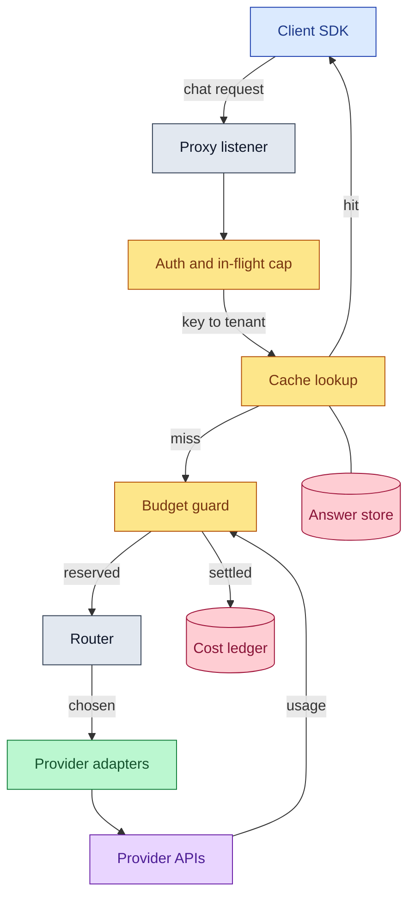

# Penstock

A single-binary LLM gateway in Go: multi-provider routing, fallback
chains, per-provider cost accounting, and benchmarks you can reproduce.

A penstock is the pressure pipe that feeds a hydro turbine. It meters,
controls, and survives high-pressure flow. Same job here.

## Security status

Bearer authentication, per-tenant rate limits and per-tenant spend caps
all work, and the loader refuses to bind anything but loopback with no
keys configured. What is still missing before this belongs on a public
address: tenant state lives in memory, so a restart forgets every
window, and there is no TLS, no key rotation, and no multi-node story.
Run it behind something that provides those.

Free provider tiers generally train on submitted prompts, so production
or otherwise sensitive data does not belong here.

## What works today

One OpenAI-compatible endpoint in front of several providers, with
streaming passthrough, fallback chains, and cost attributed to whichever
provider actually answered.

```yaml
routes:
  - model: auto
    providers: [groq, mistral, openrouter]
    strategy: round_robin
    provider_models:
      groq: llama-3.3-70b-versatile
      mistral: mistral-small-latest
      openrouter: "inclusionai/ling-3.0-flash:free"
```

That is one model name in front of three independent free tiers. Their
rate limits are separate, so chaining them multiplies the headroom any
one of them gives you.

Put a dead provider first and the chain steps over it. Live, with
`flaky` pointed at a closed port:

```
$ curl -s localhost:8088/v1/chat/completions -H "Authorization: Bearer $KEY" -d "$Q"
{"choices":[{"message":{"content":"Pacific"},"finish_reason":"stop"}], ...}

$ tail -1 penstock.log
{"msg":"request","model":"auto","provider":"groq","status":200,"duration_ms":461}

$ tail -1 demo-ledger.jsonl
{"tenant":"demo","provider_kind":"groq","usd":0.00002774,"price_version":1, ...}
```

The route is named `auto`, and both the log and the ledger say `groq`.
Attribution follows the provider that answered, not the label the
request arrived under, which is the only version of it that survives a
fallback.

### Providers

| Kind | Wire format | Verified |
|---|---|---|
| `groq` | OpenAI | live |
| `mistral` | OpenAI | live |
| `openrouter` | OpenAI | live |
| `gemini` | native, translated | live |
| `openai` | OpenAI | conformance suite |
| `cerebras` | OpenAI | conformance suite |
| `anthropic` | native, translated | conformance suite |
| `openai_compat` | OpenAI | live, against the bundled simulator |

"Live" means real traffic through the gateway against that provider's
API. "Conformance suite" means it satisfies the same contract every
adapter is held to, exercised against recorded response shapes rather
than the live service.

### Behavior worth knowing

- A stream that ends without its provider's completion marker is
  reported as truncated, never as a finished answer. Each provider
  signals completion differently: `[DONE]` on the OpenAI wire, a
  `finishReason` for Gemini, `message_stop` for Anthropic.
- Streaming requests are opted into upstream token usage where the
  provider supports it, because usage that is never reported cannot be
  billed or budgeted.
- Reasoning tokens count as completion tokens, since that is how
  providers charge for them.
- Fallback happens while connecting only. Once a stream has started,
  switching providers would splice two different answers together, so a
  mid-stream failure surfaces as truncation instead.

## How a request flows



Two orderings in that picture are deliberate. The cache is consulted
before the budget, so an answer already paid for is not charged twice.
The budget reserves an estimate before the upstream call and settles
the truth after, so a cap is enforced before the money is spent rather
than discovered afterwards.

[docs/architecture.md](docs/architecture.md) covers the package map and
the failure model; [docs/request-lifecycle.md](docs/request-lifecycle.md)
walks a single request through both transports step by step.

## Quickstart

```
cp .env.example .env        # add whichever keys you have
cp config.example.yaml config.yaml
set -a; . ./.env; set +a
make build && ./bin/penstock --config config.yaml
```

`llmsim`, a deterministic mock provider, ships alongside the gateway for
development and load testing without spending quota.

## Cost control

Every key can belong to a tenant with its own limits:

```yaml
auth:
  tenants:
    - name: demo
      keys: ["${PENSTOCK_DEMO_KEY}"]
      requests_per_minute: 60
      daily_usd: 1.00
      fail_closed: true

accounting:
  ledger_path: "penstock-ledger.jsonl"
```

A request reserves an estimate before the upstream is called and settles
the real usage after, so a limit is enforced before the money is spent
rather than after. Reserving is atomic, so a tenant cannot be overspent
by requests arriving together; it can still finish slightly over, by a
bounded amount that `internal/budget` documents and a test asserts.

A rate limit answers 429 with a Retry-After. An exhausted budget answers
402 without one, because waiting does not refill it.

```
$ # this tenant is capped at 3 requests per minute
request 4: HTTP 429  Retry-After: 34
request 5: HTTP 429  Retry-After: 34

$ curl -s localhost:9098/metrics | grep denials_total
penstock_denials_total{reason="request_rate",tenant="demo"} 5
```

Each settled request appends a ledger row carrying the tenant, model,
tokens, cost and the price list version that produced it, so a figure
can be rechecked later rather than taken on faith. `GET /admin/tenants`
on the admin listener reports live balances, and the two agree:

```
$ tail -1 penstock-ledger.jsonl
{"tenant":"demo","provider_kind":"groq","model":"llama-3.3-70b-versatile",
 "prompt_tokens":43,"completion_tokens":60,"usd":0.00007277,"price_version":1,
 "cache_hit":false,"request_id":"1"}

$ curl -s localhost:9090/admin/tenants/demo
{"name":"demo","limits":{"requests_per_minute":60,"daily_usd":1,"fail_closed":true},
 "daily_spent_usd":0.00007277,"daily_remaining_usd":0.99992723}
```

That figure is 43 prompt tokens and 60 completion tokens at the Groq
rate, and it is exact. It read `0.00` until very late: pricing looked
the vendor and model up from the *routed* name, while the price table
is keyed by the real one, so any aliased route, which is what a
fallback chain across vendors requires, missed the table and priced at
zero. A zero never trips a USD budget, so the cap silently did not
exist. It was found by taking this screenshot.

Note that many entries in the shipped price table are marked
`# unverified`. The arithmetic is exact and the ledger reconciles with
the running totals, but check the rates against provider pricing pages
before trusting the absolute numbers.

## Caching

Repeated questions are answered without calling a provider. The exact
tier canonicalizes a request first, so key order and whitespace cannot
cause a spurious miss, while a streaming and a whole answer to the same
question share one entry.

Live against Groq, the same question twice:

```
$ curl -s -w "\n  upstream call: %{time_total}s\n" localhost:8080/v1/chat/completions ...
"content":"The longest river in Africa is the Nile River, which stretches approximately 6,6
  upstream call: 0.213882s

$ # ask the identical question again
X-Penstock-Cache: hit-exact
  cached:        0.019797s
```

The 20ms is the number that means something: it is the gateway's own
cost to recognise and replay an answer. The 214ms is one sample of one
provider on one day and will move around.

What is never cached is the more important half: sampling asked to
vary, tool calls whose answer is an instruction to act, and anything
carrying a seed. Entries are keyed per tenant, so one tenant's answer
cannot surface in another's response.

The semantic tier, which answers a question similar to one already
asked, is off by default. Over 257 labelled probes, questions with
opposite meanings scored higher than genuine paraphrases often enough
that no threshold separates them:


Read the crossover. Above roughly 0.92 a raised threshold rejects
genuine paraphrases faster than it rejects opposites, so the knob meant
to make the feature safer makes it worse. At the 0.95 floor the gateway
ships, paraphrases hit 24 percent of the time and opposites hit
**43.9** percent: a semantic hit there is more likely to be answering
the wrong question than the right one. The full sweep is in [docs/cache-quality.md](docs/cache-quality.md),
reproducible with `cmd/cachestudy`, and the short version is in
[docs/semantic-caching.md](docs/semantic-caching.md).

Publishing a cache hit rate without its false hit rate is the norm and
it is meaningless. This is the false hit rate.

## Measured

Against a simulated upstream calibrated from real Groq traffic, 2400
samples per arm. **These are the Linux numbers**, because that is the
only place the comparison is fair:

| | added latency, mean |
|---|---|
| Penstock | **1.0 ms** |
| LiteLLM 1.95.0 | **12.1 ms** |

The first run of this was on Windows, where LiteLLM cannot load uvloop
at all. Comparing a Go binary against a Python proxy denied its event
loop is not a comparison, it is a handicap, so the whole campaign was
rerun on Linux and uvloop was confirmed active in the running process
rather than merely installed. It bought LiteLLM about 1.5 ms of its
13.6. That is a real improvement, and it does not close the gap. The
Windows figures are still in the docs; these are the ones to quote.


Two things the table does not say, and both matter.

Penstock's p95 and p99 deltas fall **below this harness's noise floor**,
which a null comparison of two identical arms puts at 0.96 ms. Its tail
cost is not 0.04 ms, it is smaller than this setup can resolve, and
quoting it as a number would be inventing precision. Only the mean is
a measurement.

Penstock is not faster because it is better engineered. It is faster
because it does less: LiteLLM counts tokens, computes cost, dispatches
callbacks and guardrails, and routes across far more providers. Some of
that cost buys features this gateway does not have.

Full method, every caveat, the uvloop evidence, and the runs that were
discarded are in [docs/comparison.md](docs/comparison.md). Raw k6 output
is committed beside the summaries in [bench/results/](bench/results/).

## Status

Ingress and streaming, the provider adapters, routing and fallback,
per-tenant cost control, and caching are done and exercised against
real provider APIs. The benchmark campaign is complete on both
platforms: `cmd/calibrate` records real provider latency into the
profiles llmsim replays, the k6 harness lives in [bench/](bench/), and
every number quoted above is reproducible from it.

What is deliberately not here: tenant state is in memory, so a restart
forgets every window, and there is no TLS, key rotation, or multi-node
story. See [docs/architecture.md](docs/architecture.md) for where those
edges are.

## Documentation

Start at [docs/index.md](docs/index.md). The pages worth reading on
their own:

| Page | What it answers |
|---|---|
| [architecture.md](docs/architecture.md) | How the packages fit together and which way the dependencies point |
| [request-lifecycle.md](docs/request-lifecycle.md) | What happens to one request, on both transports |
| [configuration.md](docs/configuration.md) | Every config field and what happens when you omit it |
| [cost-accounting.md](docs/cost-accounting.md) | How an estimate becomes a settled, auditable row |
| [cache-quality.md](docs/cache-quality.md) | The 257-probe semantic sweep, including the result that killed the feature |
| [comparison.md](docs/comparison.md) | Full benchmark method, the uvloop evidence, and the discarded runs |
| [adr/](docs/adr/) | The decisions, with what each one cost |

## License

Apache-2.0
