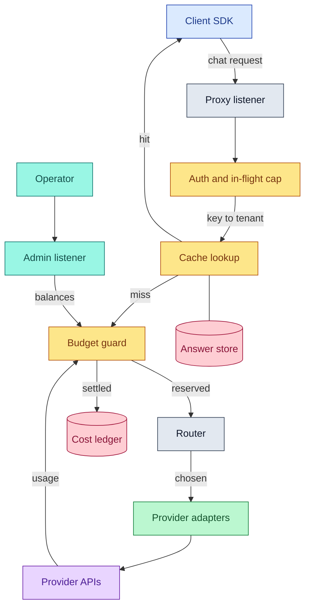
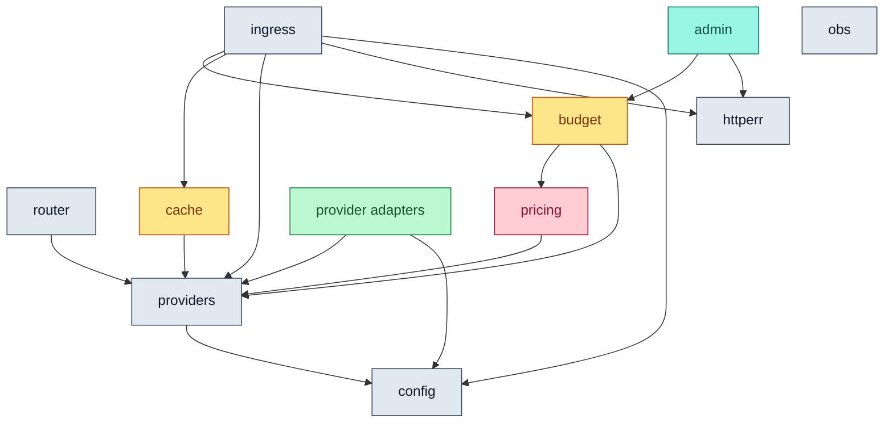
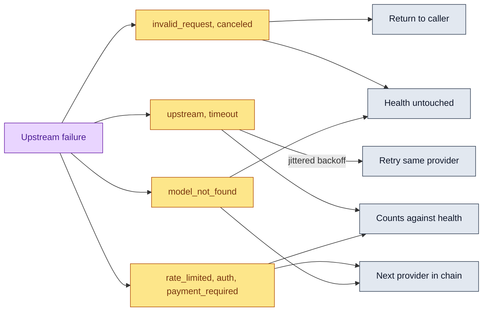

# Architecture

Penstock is one Go binary that sits between an OpenAI-compatible client
and several provider APIs. It authenticates the caller, decides whether
it already has the answer, decides whether the caller may afford a new
one, picks an upstream, translates the wire format if it has to, and
records what the answer cost.

This page is the map. It covers what the pieces are, who owns what, which
way the dependencies point, and what happens when something breaks. The
step by step walk through one request lives in
[request-lifecycle.md](request-lifecycle.md).

## How to read the diagrams

Every diagram on this page and in
[request-lifecycle.md](request-lifecycle.md) uses one palette, so a color
means the same thing everywhere.

| Color | Role | Meaning |
|---|---|---|
| Blue | Client surface | Something outside the gateway that calls it |
| Grey | Gateway internals | Code in this repository that moves a request along |
| Amber | Policy or decision point | A place that can refuse, divert, or short circuit a request |
| Green | Provider adapter | Code that speaks one upstream wire format |
| Purple | External service | A third party API the gateway calls out to |
| Pink | Storage | Something that outlives one request |
| Teal | Operator surface | The admin listener and whoever reads it |

## The request path

Three things in that picture are worth saying out loud.

**There are two listeners, not one.** The proxy listener carries caller
traffic. The admin listener carries metrics and per tenant spend, and it
defaults to loopback. Money and token profiles are operator data, not
caller data, and putting them on the same port as the chat API means the
only thing keeping them apart is a path prefix. See
[ADR 0003](adr/0003-metrics-on-a-separate-admin-listener.md) and
[admin-api.md](admin-api.md).

**The cache sits before the budget.** A hit calls no provider, so there is
no cost to reserve and nothing to settle. The reasoning behind that
ordering is in [request-lifecycle.md](request-lifecycle.md#the-cache-hit-path).

**The admin listener reads the same counters the request path writes.**
It is handed the live enforcer, not a copy of it. An admin API with its
own accounting would report balances nobody is actually enforcing, which
is a worse failure than no admin API at all.

## Package map

Every package below lives under `internal/`. The "does not own" column is
the load bearing one: most of the design is in what a package was kept
away from.

| Package | Owns | Deliberately does not own | Decision record |
|---|---|---|---|
| `config` | Loading and validating YAML, env var expansion, defaults, the loopback fail safe | Anything about how the gateway behaves at runtime. It is a leaf and cannot import upward. | [configuration.md](configuration.md) |
| `httperr` | The client-facing JSON error envelope and its type vocabulary | Deciding which errors happen. It only decides what one looks like on the wire. | [ADR 0009](adr/0009-one-client-error-envelope.md) |
| `providers` | The `Provider` contract, the error class vocabulary, the adapter registry, the model name rewrite | Any wire format. It defines the shape adapters translate into and knows none of them. | [ADR 0004](adr/0004-provider-adapter-contract-and-conformance-suite.md) |
| `providers/openaiwire`, `providers/gemini`, `providers/anthropic` | One upstream wire format each, including how that provider signals a finished stream | Routing, retries, cost, caching. An adapter answers or fails, and says which class of failure it was. | [ADR 0002](adr/0002-stream-completeness-is-provider-specific.md) |
| `providers/conformance` | The executable contract every adapter has to satisfy | Being a provider. It is the test suite, shared so adapters cannot drift apart. | [ADR 0004](adr/0004-provider-adapter-contract-and-conformance-suite.md) |
| `router` | Turning one model name into an attempt across a chain, the failure policy, the circuit breaker, selection strategy | The HTTP surface. It implements `providers.Provider`, so the ingress cannot tell a routed model from a single provider. | [ADR 0006](adr/0006-fallback-only-before-the-first-byte.md), [ADR 0007](adr/0007-router-failure-policy.md) |
| `pricing` | The embedded versioned price table, usage to USD, the append-only ledger | Enforcement. It prices things; it never refuses one. | [ADR 0005](adr/0005-one-embedded-versioned-price-table.md) |
| `budget` | Estimating a request, reserving atomically, settling the actual, per tenant windows and rate limits | Knowing what a token is worth in any deeper sense than the price table says, and knowing anything about HTTP. It returns a `Denial`, not a status code. | [ADR 0008](adr/0008-two-phase-budget-enforcement.md), [cost-accounting.md](cost-accounting.md) |
| `cache` | Eligibility policy, request canonicalization, the tenant scoped key, the exact tier, the opt-in semantic tier | Deciding when to call it. The ingress does that, and the cache never learns there is a provider behind it. | [ADR 0010](adr/0010-tenancy-is-part-of-the-cache-key.md), [ADR 0011](adr/0011-semantic-cache-tier-is-opt-in-with-a-0.95-floor.md) |
| `ingress` | The caller-facing HTTP API, auth, the in-flight cap, SSE framing, stream truncation handling, the order the policies run in | Routing decisions, pricing, wire formats. It orchestrates; it does not implement any of them. | [ADR 0009](adr/0009-one-client-error-envelope.md) |
| `admin` | The operator API: configured limits and spend per tenant | Keys, prompts, completions, and prices. It is not given access to any of them, which is why exposing its listener would still leak nothing sensitive. | [ADR 0003](adr/0003-metrics-on-a-separate-admin-listener.md), [admin-api.md](admin-api.md) |
| `obs` | The Prometheus registry, the logger, OTLP tracing setup | Being imported by the request path. The ingress declares its own sink interface, which `obs.Metrics` happens to satisfy. | [observability.md](observability.md) |
| `llmsim` | A deterministic mock provider for development and load testing | Anything shipped in the request path. It exists so benchmarks do not spend quota. | [comparison.md](comparison.md) |

`cmd/penstock` is the only place that imports every one of these. It reads
config, builds adapters, wraps each route's chain in a router, assembles
the cache tiers, builds the budget guard, and hands the result to the
ingress as a set of options. Nothing else in the tree knows the whole
graph, which is what keeps the graph acyclic.

## Which way the arrows point

`config` is at the bottom because it has no internal imports at all, and
it must not acquire any. It is the package that decides whether the
gateway is allowed to start, and that decision has to be answerable
without constructing a single provider, cache, or enforcer. If `config`
could import `providers` to ask whether a kind is real, then a validation
bug and an adapter bug would become the same bug, and the loopback fail
safe would depend on code that only runs after the loader has already
said yes. Kind validation is instead done by the adapter registry at
build time, which is why a binary that forgets to blank import an adapter
fails at startup rather than on the first request for that model.

Two absences in that graph carry weight:

- **`ingress` does not import `router`.** A router is a
  `providers.Provider`. A route with one provider and a route with a
  fallback chain of four are the same type to the ingress, so there is no
  code path that only exists when fallback is configured.
- **`ingress` does not import `obs`.** It declares a small sink interface
  that `obs.Metrics` satisfies structurally. The request path therefore
  carries no metrics library import, and the ingress tests need no
  registry.

`obs` sits in the graph with no internal edges in either direction. It is
constructed by `cmd/penstock` and passed in.

## The failure model

The gateway's job is to be honest about failure rather than to hide it.
Four failures matter enough to state plainly.

### A provider is down

The adapter classifies the failure, and the router decides what that
class permits. The full reasoning is
[ADR 0007](adr/0007-router-failure-policy.md); the shape is this:

A rate limit fails over immediately rather than retrying, because the
point of chaining free tiers is that a different bucket has room right
now. A bad payload fails immediately and counts against nothing: every
provider in the chain would reject it identically, so failing over would
turn one client mistake into four upstream calls, and letting it trip a
breaker would let one bad caller take a healthy provider out of rotation
for everyone.

The breaker parks a provider for a bounded cooldown and then admits
exactly one probe to learn whether it came back. A rate limited provider
waits for whatever `Retry-After` it sent, and about half a minute when it
sent none, because free tiers usually meter per minute. A provider that
cannot pay waits fifteen minutes, because nothing refills there until an
operator adds credit, and the wait stays bounded so the provider rejoins
by itself without a restart.

The whole chain shares one attempt budget, three upstream calls per client
request by default. The loop reserves one of those for each provider it
has not tried yet, so a retry loop against a sick provider cannot eat the
budget and starve a healthy peer further down the chain. This also means a
chain longer than the attempt budget will not try every member on a single
bad request, which is the intended trade: a client waiting on a completion
is better served by one honest failure than by six sequential timeouts.

The router's tuning (attempt budget, backoff steps, breaker threshold and
cooldown) is set under `router` in `config.yaml`. It is global rather
than per route because health is shared, which is the same reason one
route learning a provider is broken spares the others. See
[configuration.md](configuration.md#router) for the fields and their
bounds. Omitting the block leaves every default in place.

When every provider in a chain is parked, the request fails with
`no healthy provider is available for this model` rather than hammering
an upstream the gateway already knows will refuse.

### The accounting store cannot answer

Each tenant declares what it wants when the gateway is blind. With
`fail_closed: true`, a request is refused with 503 and
`accounting_unavailable`: a hard cap on real money should refuse rather
than guess. Without it, the request is served unmetered, which is what an
operator running a soft internal limit wants.

Today the enforcer keeps its counters in memory behind one mutex, so
"cannot answer" is a state the interface models rather than one that
arrives on its own. It is modeled anyway because the enforcer is meant to
be backed by something remote later, and a policy that is only invented
at the moment the store first fails is a policy nobody has thought about.
The consequence of the in-memory choice today is different and worth
knowing: a restart forgets every window, so a tenant's daily spend
returns to zero.

A ledger that cannot be written never fails a request. The answer is
already on its way to the client, and losing an audit row is the smaller
loss. It is logged loudly rather than swallowed, because a silently
unwritable ledger reads exactly like a quiet day.

### The embedder is unreachable

Every embedder failure is a cache miss. The lookup emits an
`embed_failed` event for metrics and returns as though nothing similar
had been stored. An embedder that is down or slow may cost a hit; it may
never cost a request. The same is true on the write side: an answer whose
vector could not be computed is still stored in the exact tier and still
returned to the caller.

The semantic tier is off by default for reasons that have nothing to do
with availability. See [semantic-caching.md](semantic-caching.md) and the
threshold sweep in [cache-quality.md](cache-quality.md).

### A stream truncates

This is the failure the gateway is most opinionated about. An SSE
response has already sent `200 OK` before the first token arrives, so
there is no status code left to fail with, and a client that is handed a
partial answer with a clean ending has no way to know.

So completeness is decided by the provider's own marker: `[DONE]` on the
OpenAI wire, a non-empty `finishReason` for Gemini, `message_stop` for
Anthropic. A stream that ends without its marker is reported as truncated
and never as a finished answer
([ADR 0002](adr/0002-stream-completeness-is-provider-specific.md)). In
practice that means:

- The terminal `[DONE]` frame is written only for a stream the upstream
  actually finished. A truncated one gets an error frame carrying
  `stream_truncated` instead.
- Nothing is cached. Only a stream that ended cleanly is stored, because
  replaying a partial answer would serve a truncation forever as though
  it were whole.
- No provider switch happens. Once the first byte is on the wire,
  failing over would splice two different completions into one response
  ([ADR 0006](adr/0006-fallback-only-before-the-first-byte.md)).
- The reservation is settled against whatever usage the provider actually
  reported, and released entirely when it reported none. Settling on the
  estimate instead would bill a guess.

An upstream that goes quiet past its idle budget is treated as a
truncation, as is one that accepts a connection and never sends response
headers. A client that disconnects mid-stream causes the upstream call to
be released promptly, and the reservation is still closed out on a context
that the disconnect cannot cancel.

## Where to go next

- [request-lifecycle.md](request-lifecycle.md) for one request, start to
  finish, twice: streamed and not.
- [adr/README.md](adr/README.md) for the eleven decisions this page
  summarizes.
- [configuration.md](configuration.md) for the knobs that change any of
  the above.
