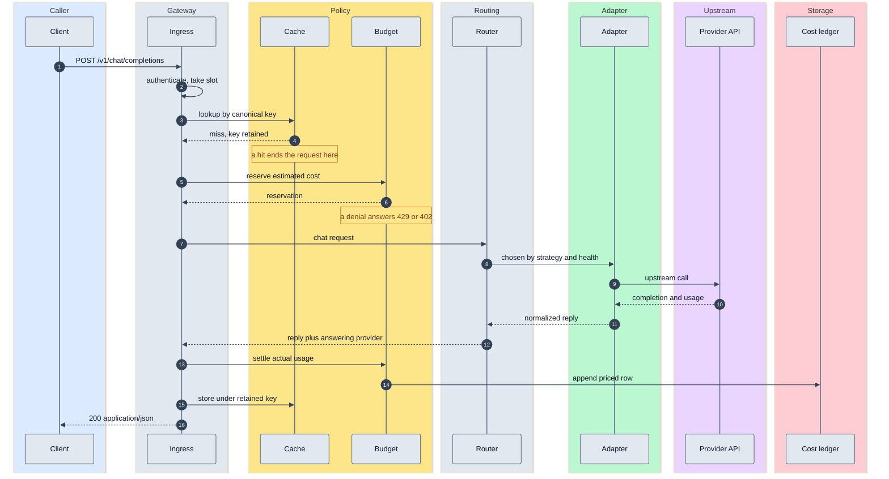
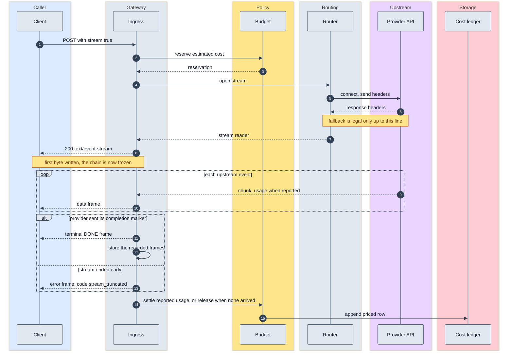
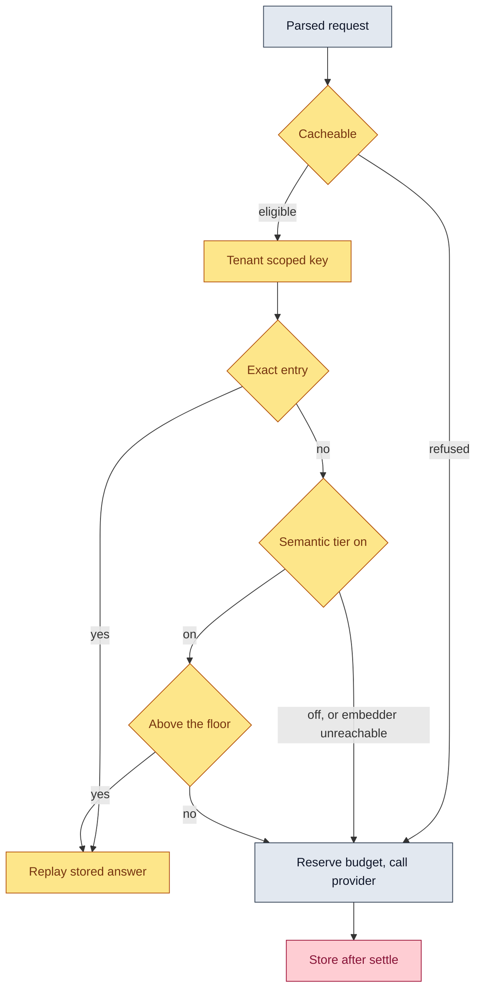

# The life of a request

One request through Penstock passes seven decision points, and each one
can end it. This page walks both shapes it can take, non streaming and
streamed, and then explains the one ordering choice that surprises people:
why the cache runs before the budget.

For the packages behind these steps and the palette these diagrams share,
see [architecture.md](architecture.md).

## A non streaming request

### What each decision point can do

**Auth.** A bearer key is matched against every configured digest in
constant time, so timing reveals neither whether a key matched nor which
one. A matching key carries a tenant name, and that name is what the rest
of the request is billed and limited against.

A key configured under `auth.client_keys` rather than under a tenant
authenticates the same way but carries no identity. On a deployment with
no tenants at all, that is the whole story: nothing is metered and nothing
needs to be. On a deployment that does configure tenants, budgeting is
active for every request that reaches it, and a request arriving without a
tenant identity has no account to charge. Give every key an owner once
tenants exist.

Before the handler runs, the request also has to claim an in-flight slot.
The gateway sheds rather than queues: a caller that cannot get a slot
immediately gets 503 with a `Retry-After`, because queueing behind a full
gateway converts a capacity problem into a latency problem for everyone
already inside.

**Cache lookup.** Three outcomes, not two. A hit serves the stored answer.
A miss returns a key for the response to be stored under. A refusal
returns neither, because policy said this request may never be cached at
all, and the response must not be stored either. Tool calls, seeds, and
sampling asked to vary are refused
([ADR 0011](adr/0011-semantic-cache-tier-is-opt-in-with-a-0.95-floor.md)
covers the similarity tier; the refusals are in the `internal/cache`
package documentation).

**Budget reserve.** The estimate is claimed atomically before the upstream
is called. Reserving after would be measuring a limit against money
already spent. A refusal here distinguishes two situations that look
alike and are not: a rate limit answers 429 with a `Retry-After`, and an
exhausted budget answers 402 without one, because waiting does not refill
it. See [ADR 0008](adr/0008-two-phase-budget-enforcement.md) and
[cost-accounting.md](cost-accounting.md).

**Route selection.** The model name in the request body selects a route,
and the route is a chain. The selector orders the chain by strategy
(configured priority, round robin, or least observed latency) after
excluding anything the health tracker has parked. Exclusion happens before
ordering, so a flattering latency average can never talk an open breaker
into a call.

**Provider call.** Adapters translate into the OpenAI response shape, so
the ingress never learns a wire format
([ADR 0004](adr/0004-provider-adapter-contract-and-conformance-suite.md)).
A chain can span vendors that do not share a model vocabulary, so each
provider is asked for the name it actually knows, rewritten into a copy of
the body rather than into the caller's request.

**Settle.** Cost and latency are attributed to whichever provider actually
answered, not to the route's label. A call that produced nothing returns
its claim untouched, so a failed upstream costs the tenant nothing. Settle
and release are each idempotent per reservation.

**Ledger write.** One row per settled request, carrying the tenant, model,
tokens, cost, and the price list version that produced the figure, so it
can be rechecked later rather than taken on faith
([ADR 0005](adr/0005-one-embedded-versioned-price-table.md)). A failed
write is logged and does not fail the request.

Storing the answer happens after settling on purpose: the stored entry
then carries the usage of the call that produced it, which is what lets a
later hit report what it avoided.

## A streamed request

The streamed path is the same up to the moment the response header is
written, and different in one way that governs everything after it.

### Where fallback stops being legal

Up to the response headers, a failure is a routing problem: the gateway
can close the connection, pick another provider, and the client is none
the wiser. After the first byte of the SSE body is written, it is not.
Switching providers there would splice two different completions into one
response, and the client would receive a single answer that changed its
mind halfway through with no marker saying so. That is worse than a
visible failure, so the gateway takes the visible failure
([ADR 0006](adr/0006-fallback-only-before-the-first-byte.md)).

This is also why the header wait has its own timeout separate from the
idle timeout. The idle timer only starts once headers arrive, so an
upstream that accepts a connection and then says nothing would otherwise
hang forever in the one window where fallback would still have been legal.

### Where usage is settled

At the end of the stream, once, from the last usage report the provider
sent. Providers differ: some report totals once at the end, some repeat
cumulative totals on every chunk. Keeping only the most recent report is
correct for both, where summing would multiply the count. Streaming
requests are opted into upstream usage reporting wherever the provider
supports it, because usage that is never reported cannot be billed or
budgeted.

A stream that ended without ever reporting usage produced no billable
evidence, so its claim is released rather than settled at a number nobody
measured.

Settling runs on a context the client's disconnect cannot cancel. A caller
that hangs up mid-stream still consumed provider tokens, and dropping the
settle there would let a tenant avoid its own bill by closing the
connection.

### What gets stored

Only a stream the upstream actually finished. Frames are collected as they
are forwarded, up to a size ceiling; past that ceiling the answer is still
served, just not remembered, because a half remembered answer would replay
as a truncation of a completion that really did finish.

A stored streamed answer and a stored whole answer are the same entry.
`stream` chooses a transport, not an answer, so it is dropped before the
cache key is hashed, and one entry serves a caller who asked for either.
A caller asking for a stream when only a whole answer was stored is served
live instead: re-chunking a complete response would invent a frame shape
the provider never sent.

## The cache hit path

A hit skips both the provider and the budget. It carries an
`X-Penstock-Cache` response header, so a client debugging why a model
appears to be repeating itself can tell a replay from a fresh answer
without guessing.

### Why the cache runs first

A hit calls no provider. There is no cost to reserve against and nothing
to settle afterwards, so running the budget first would mean reserving an
estimate for a call that is never going to happen and then handing it
straight back.

The consequence is deliberate and worth being explicit about: **a tenant
sitting at its spend cap is still served an answer the gateway already
has.** That is the behavior an operator wants. The cap exists to bound
what gets spent, not to withhold what has already been paid for. Charging
for a call that never happened is the same bug as not charging for one
that did, pointed the other way.

The saving is still visible. A hit records the tokens it avoided as
metrics, so an operator sees what the cache is worth, while the tenant's
balance does not move. Concurrency stays bounded either way, because the
in-flight cap is claimed before any of this.

### Why the key is per tenant

Tenancy is part of the hashed key rather than a filter applied after a
lookup. Filtering after the fact works right up until someone reorders the
code, and the failure it prevents is one tenant's prompt or answer
surfacing in another tenant's response. That is a data leak, not a
performance regression, so it is structural and not configurable
([ADR 0010](adr/0010-tenancy-is-part-of-the-cache-key.md)).

The key hashes the request's meaning rather than its bytes: the body is
canonicalized first, so key order and whitespace cannot cause a spurious
miss. Fields the gateway does not model are hashed anyway. An unknown
field that does change the answer then costs a miss, while dropping it
would serve the wrong answer, and only one of those two mistakes is
recoverable.

## Related pages

- [architecture.md](architecture.md) for the package map and the failure
  model.
- [cost-accounting.md](cost-accounting.md) for pricing, the overshoot
  bound, and the ledger format.
- [observability.md](observability.md) for the metric each step emits.
